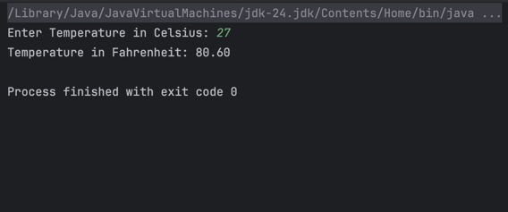

## Lab 1: Celsius to Fahrenheit Converter
Write a program that takes in a float Celsius, and displays its equivalent value in Fahrenheit in two decimal places. The formula is as follows: °F = °C × (9/5) + 32.

## Screenshot of Output

